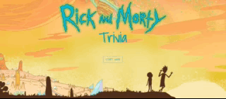

# Rick-And-Morty-Trivia

Whats a plumbus? Who knows? That's why that isn'ta  question on this Rick And Morty themed trivia game. You'll have about 30 seconds to answer the questions by clicking on one of the buttons. If you click on an incorrect answer or fail to answer in the alloted time, you will be "disqualified" by the Cromulon, also a .gif the correct answer will display. If you answer correctly you will be a "winner" and a .gif will display . Both correct and incorrect(plus unanswered) .gif's will be shown for 5 seconds before the next question automatically pops up. There are ten questions, once all ten are finished you will be given stats on how well you did. Try your best to answer them all correctly.'

## Getting Started
Go to [github.com/aewagner/Rick-And-Morty-Trivia](https://github.com/aewagner/Rick-And-Morty-Trivia) to access my repository. 

Also check out the live version of the game here [aewagner.github.io/Rick-And-Morty-Trivia/](https://aewagner.github.io/Rick-And-Morty-Trivia/).

## Built With
+ HTML
+ CSS
+ Bootsrap 4
+ Flexbox
+ Javascript
+ jQuery

## Acknowledgements
+ [Bootstrap](https://getbootstrap.com/)
+ [Google Fonts] (https://fonts.google.com/)
+ Rick and Morty